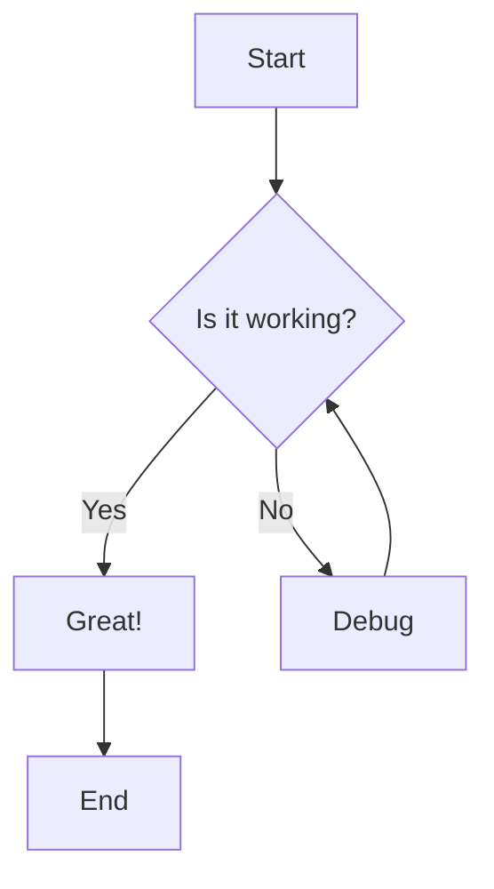
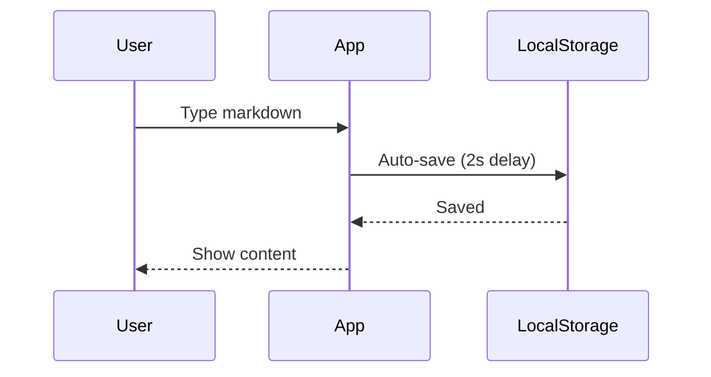
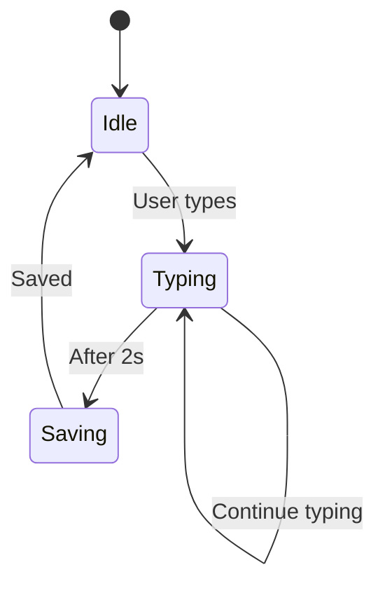

# Advanced Features Test

This file tests all the new advanced features of the Markdown Viewer.

## 1. Mermaid Diagrams

### Flowchart Example

### Sequence Diagram

## 2. KaTeX Math Rendering

### Inline Math

The quadratic formula is $x = \frac{-b \pm \sqrt{b^2-4ac}}{2a}$, which is fundamental in algebra.

### Block Math

$$
\int_{-\infty}^{\infty} e^{-x^2} dx = \sqrt{\pi}
$$

$$
E = mc^2
$$

$$
\nabla \times \mathbf{E} = -\frac{\partial \mathbf{B}}{\partial t}
$$

## 3. Table of Contents

The TOC button (List icon) should appear in the bottom-right corner. Click it to see:

### Level 3 Heading
Content here

#### Level 4 Heading
More content

##### Level 5 Heading
Even more

## 4. Local Storage Auto-save

- Type anything in the editor
- Wait 2 seconds
- Refresh the page
- Your content should be restored automatically!

## 5. Keyboard Shortcuts

Try these shortcuts:

| Shortcut | Action |
|----------|--------|
| `Ctrl+O` | Open file |
| `Ctrl+S` | Save file (if file handle available) |
| `Ctrl+E` | Export HTML |
| `Ctrl+P` | Export PDF/Print |
| `Ctrl+/` | Toggle view mode |
| `Ctrl+D` | Toggle dark mode |

## 6. Combined Features

### Math in a List

1. First equation: $a^2 + b^2 = c^2$
2. Second equation: $\sum_{i=1}^{n} i = \frac{n(n+1)}{2}$
3. Third equation: $\lim_{x \to \infty} \frac{1}{x} = 0$

### Code + Mermaid

Here's a state diagram for the app:

---

## All Features Working?

If you can see:
- ✅ Rendered Mermaid diagrams
- ✅ Beautiful math equations
- ✅ Floating TOC button
- ✅ Content persists on refresh
- ✅ Keyboard shortcuts work

Then all advanced features are **successfully implemented**! 🎉
